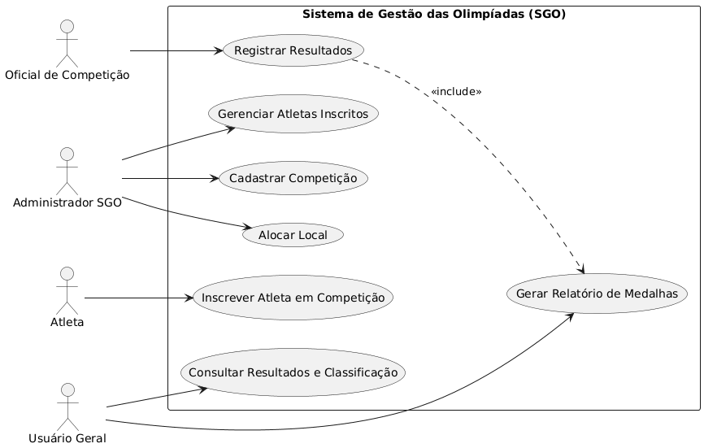
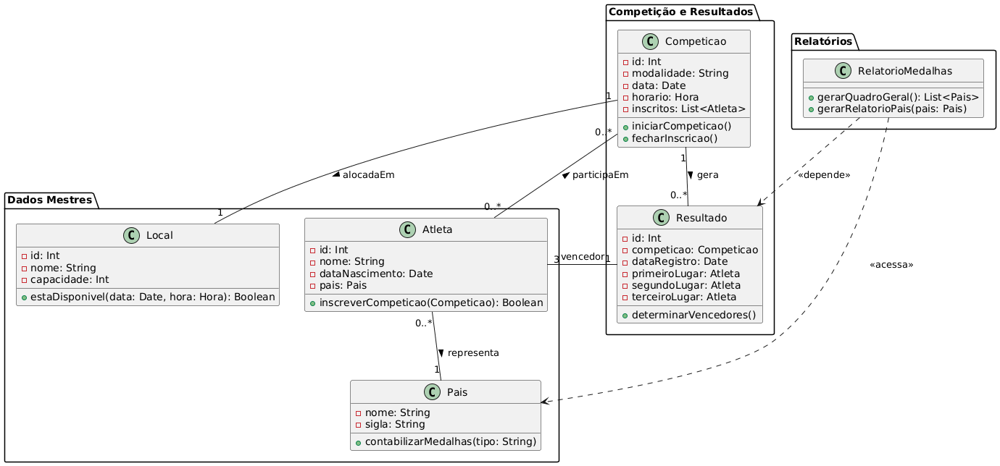
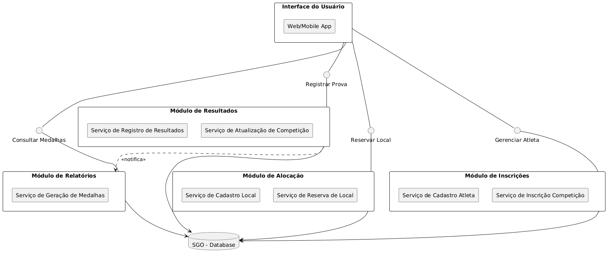
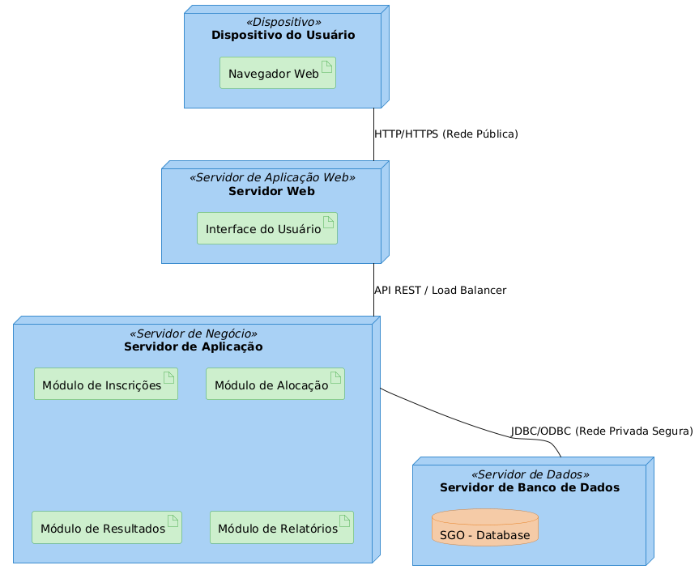

# Sistema-gestao-olimpiadas

# Sistema de Gestão das Olimpíadas (SGO) - Projeto de Software

**Disciplina:** Projeto de Software
**Professor:** João Paulo Carneiro Aramuni
**Aluno:** Pedro Teodoro Castro Valadares 

## 1. Descrição do Sistema

O **Sistema de Gestão das Olimpíadas (SGO)** é uma aplicação desenvolvida para coordenar os diferentes aspectos logísticos e operacionais de um evento olímpico. O sistema abrange desde o cadastro de competições e alocação de locais até a inscrição de atletas e o controle final de resultados e medalhas.

## 2. Histórias de Usuário (User Stories)

As seguintes histórias de usuário foram definidas com base nas regras de negócio do SGO:

| ID | Papel | Objetivo | Justificativa |
| :--- | :--- | :--- | :--- |
| **US01** | Administrador do SGO | **Cadastrar uma Competição** informando modalidade, data, horário e local. | ...para que ela esteja disponível para inscrições. |
| **US02** | Atleta | **Inscrever-me em Competições**, representando meu país. | ...para garantir minha participação nas provas. |
| **US03** | Administrador do SGO | **Alocar Locais para Competições**, garantindo que o local esteja livre no horário. | ...para evitar conflitos na agenda das provas. |
| **US04** | Oficial de Competição | **Registrar os Resultados de uma Competição**, indicando o 1º, 2º e 3º colocados. | ...para finalizar a prova e contabilizar as medalhas. |
| **US05** | Usuário Geral | **Visualizar Relatórios de Medalhas**, mostrando o desempenho de cada país (Ouro, Prata e Bronze). | ...para acompanhar o quadro geral das Olimpíadas. |

## 3. Diagramas UML

Abaixo estão os diagramas UML desenvolvidos para modelar a estrutura e a arquitetura do Sistema de Gestão das Olimpíadas. Os arquivos-fonte editáveis (`.drawio`) encontram-se na pasta `/modelagens`.

### 3.1. Diagrama de Caso de Uso

**Modelagem dos Casos de Uso Principais (Requisitos Funcionais) e seus Atores.**

### 3.2. Diagrama de Classes e de Pacotes

**Modelagem da estrutura estática do sistema, classes, atributos, relacionamentos e organização em pacotes lógicos (`Dados Mestres`, `Competição e Resultados`, `Relatórios`).**

### 3.3. Diagrama de Componentes

**Modelagem da arquitetura lógica, mostrando os módulos principais do sistema e a forma como interagem através de interfaces.**

### 3.4. Diagrama de Implantação

**Modelagem da arquitetura física (hardware), ilustrando a distribuição dos componentes lógicos (artefatos) nos nós físicos (servidores e clientes).**

## 4. Estrutura do Repositório

O repositório está organizado conforme a seguinte estrutura de arquivos:

• Imagens/diagrama_de_caso_de_uso.png
• Imagens/diagrama_de_classes_e_pacotes.png
• Imagens/diagrama_de_componentes.png
• Imagens/diagrama_de_implantação.png
• Modelagem/diagrama_de_caso_de_uso.drawio 
• Modelagem/diagrama_de_classes_e_pacotes.drawio
• Modelagem/diagrama_de_componentes.drawio 
• Modelagem/diagrama_de_implantação.drawio 
